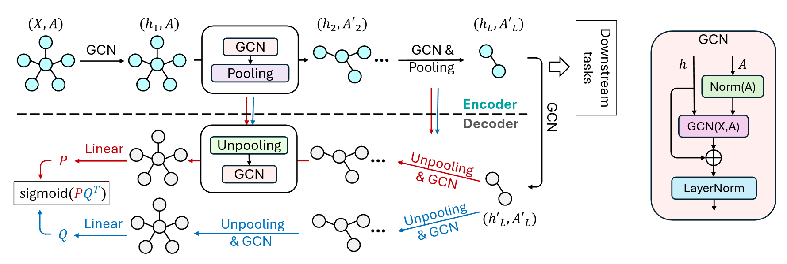

# GraphCroc
This is the repo of our work, GraphCroc: Cross-Correlation Autoencoder for Graph Structural Reconstruction, in NeurIPS(2024).

## 🏖️ Environment
GraphCroc is developed on [PyG](https://pytorch-geometric.readthedocs.io/en/latest/). Generally, please ensure `PyTorch >= 1.11.0`, `python >= 3.8`, and `pyg >= 2.0.4`. Other depedency might be required as well.

## 🗂️ File Stack
| File         | Description |
| ------------ | ----------  |
| /GraphCroc/UNET.py  | The two-way Unet model |
| /GraphCroc/UNET_onebranch.py  | The one-way Unet model       |
| /GraphUNET/ops.py | Opeartions from [Graph U-Nets](https://github.com/HongyangGao/Graph-U-Nets) |
| IMDB_B | A dataset example for GraphCroc (Cross-Correlated) |
| /IMDB_B/enhance.ipynb | The toy story for different enhancement explored in our work |
| /IMDB_B/gc_train.py | They downstream task example for graph classification |
| /IMDB_B/reconstructor.py | **The main file to train GraphCroc** |
| /IMDB_B/wl_test_util.py | Utils file for WL-test |
| /IMDB_B/wl_test.py | WL-test file |

## 🛫 Code Take-off
Current GraphCroc repo is hard coded, and a more structural one is growing.
1. Create folder `resLog` and `tdModels` to save results.
2. Main file for training GraphCroc: `cd IMDB_B; python3 reconstructor.py`
3. WL-test: `python3 wl_test.py`
4. Graph classification task (100-epoch sample): `python3 gc_train.py`
